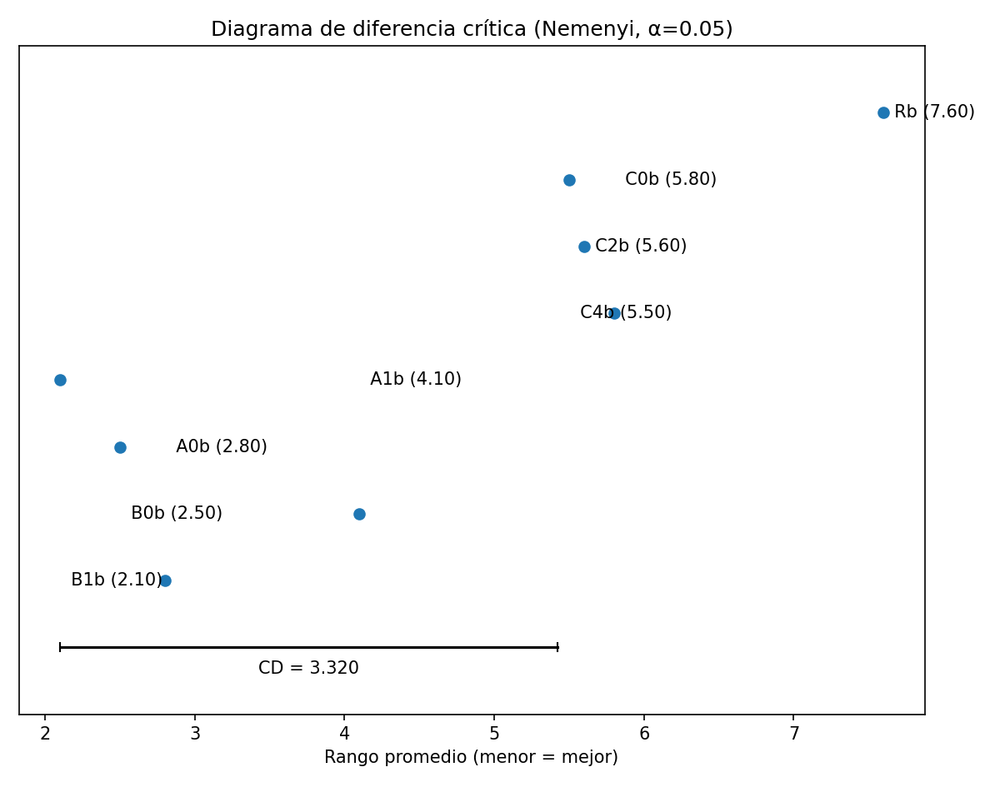

# Tikee — Selección de variables cuántico-inspirada para scoring crediticio

Proyecto de innovación universitaria · UTPL Ecuador · Inspirado en el pitch de la fintech Tikee.
**Datos 100% sintéticos.** **"Cuántico-inspirado" = recocido simulado clásico.** Ver [Advertencias](#advertencias).

**🔗 App en vivo:** **[web-production-e797c.up.railway.app](https://web-production-e797c.up.railway.app)** — 5 pestañas interactivas, sin instalar nada. Empieza por la [guía de usuario](docs/GUIA_USUARIO.md) si es tu primera visita.



## Pregunta de investigación

¿Formular la selección de variables como un problema **QUBO** mejora un modelo de scoring crediticio frente a LASSO o stepwise, cuando las variables candidatas están fuertemente correlacionadas entre sí?

El mismo QUBO se resuelve con **cinco solucionadores** para separar tres preguntas que la literatura suele confundir:

1. ¿Es buena **la formulación** QUBO relevancia-redundancia? → recocido vs. LASSO
2. ¿Aporta algo **el heurístico**? → recocido vs. óptimo certificado (enumeración exacta / MILP)
3. ¿Aporta algo **el paradigma de circuitos**? → QAOA simulado vs. recocido

**Resultado en una frase:** en 18 variables, QUBO empata en precisión con LASSO/stepwise (gana en parsimonia, pierde en estabilidad de selección); en 45 variables, **pierde con significancia estadística**, con causa diagnosticada. El hallazgo que sí se sostiene: la selección QUBO reduce la codificación indirecta de un atributo protegido de AUC=1.00 a 0.61, simplemente por usar menos variables. Detalle completo en [reports/INFORME.md](reports/INFORME.md).

## Advertencias

- Los datos son **sintéticos**, generados con una cópula gaussiana propia + SDV y calibrados con rangos públicos (SEPS, burós de crédito, INEC) como referencia orientativa. Ninguna cifra describe a ninguna cooperativa real.
- **"Cuántico-inspirado" = recocido simulado clásico.** El brazo de QAOA es un circuito cuántico **simulado clásicamente**. **No se usa hardware cuántico en ningún momento.**
- QAOA aquí **no puede ganar**: en N=18 el óptimo global ya se conoce por enumeración, y simular el circuito es órdenes de magnitud más caro (~25 min por profundidad vs. 0.4 s de la enumeración). Se incluye para medir esa brecha, que es un resultado legítimo. En N=45 ni siquiera puede ejecutarse (requeriría 563 TB de RAM).

## Estado

**Implementación completa, F0–F8.** `pytest` en verde (26/26). App Streamlit de 5 pestañas desplegada y verificada en producción. Ver [reports/INFORME.md](reports/INFORME.md) y [reports/RESULTS.md](reports/RESULTS.md) para el análisis y las cifras finales.

Cuatro desviaciones documentadas respecto a `ARCHITECTURE.md` (tres de calibración de datos en F1 + una reducción de presupuesto de cómputo en F6), explicadas en `reports/INFORME.md` §5 y marcadas `[DESVIACIÓN DOCUMENTADA]` en el código. Ninguna afecta los dos checkpoints innegociables (F1: AUC en banda; F4: C1==C2 exacto — verificado en las 10 semillas), ambos en verde.

## Despliegue

| Dónde | Qué es | URL |
|---|---|---|
| **Railway** | App Streamlit completa (5 pestañas, interactiva) | [web-production-e797c.up.railway.app](https://web-production-e797c.up.railway.app) |
| **GitHub** | Código fuente, historial, issues | [github.com/0KevinB/tikee-quantum-scoring](https://github.com/0KevinB/tikee-quantum-scoring) |

`Procfile` / `railway.json` fijan el comando de arranque. Cuatro artefactos de `reports/cache/`
están versionados a propósito (excepción documentada en `.gitignore`) porque la app los lee en
vivo y regenerarlos en el contenedor de despliegue requeriría correr el pipeline completo (~1 h).

## Reproducción local

```bash
make setup && make verify && make experiment && make app
```

`make experiment` corre el pipeline completo de 10 semillas (~1 h). Los resultados de esta
entrega ya están cacheados en `reports/` y `reports/cache/`; `make app` funciona directamente
sobre ellos sin necesidad de recorrer `make experiment` de nuevo.

## Estructura del proyecto

```
src/tikee/
├── config.py              # carga YAML, fija semillas globales
├── data/                  # generación sintética: semilla programática, SDV, target, validación
├── features/              # preprocesamiento (ColumnTransformer) y expansión Nivel A → Nivel B
├── selection/              # relevancia, redundancia, matriz QUBO, 5 solucionadores
├── models/                # entrenamiento, métricas, interpretabilidad, equidad
├── experiments/           # orquestación por semilla, bucle multi-semilla, estadística
└── viz/                   # gráficos reutilizables (Plotly) para la app

app/                        # Streamlit: portada + 5 páginas
scripts/                     # un script por fase F0–F8, ejecutable independientemente
tests/                       # 26 pruebas (pytest), ver Definición de listo en PLAN.md §8
reports/                     # INFORME.md, RESULTS.md, figuras, informe DOCX, presentación PPTX
docs/                        # guía de usuario de la app web
```

Cada módulo de `src/tikee/` tiene un docstring de cabecera explicando su rol; las funciones
públicas documentan parámetros y retorno. Ver también `ARCHITECTURE.md` para el diseño completo.

## Stack tecnológico

Python 3.11 · scikit-learn · XGBoost · SDV (síntesis de datos) · D-Wave Ocean SDK (recocido
simulado, Tabú) · SciPy/HiGHS (MILP) · Qiskit + Qiskit Aer (circuito cuántico simulado) ·
statsmodels (VIF, stepwise, Friedman) · Streamlit (app) · Railway (despliegue).

## Documentos

| Archivo | Contiene |
|---------|----------|
| [PLAN.md](PLAN.md) | Calibración de plazo, alcance, decisiones D1–D20, cronograma por fases, riesgos, honestidad metodológica |
| [ARCHITECTURE.md](ARCHITECTURE.md) | Stack, estructura, flujo de datos, esquema de 18 variables + expansión a 45, sesgo inyectado, formulación QUBO, cinco solucionadores, diseño experimental, auditoría de equidad |
| [reports/INFORME.md](reports/INFORME.md) | Análisis honesto de resultados, interpretabilidad regulatoria SEPS, limitaciones |
| [reports/RESULTS.md](reports/RESULTS.md) | Tablas de métricas generadas desde `reports/results.json` |
| [reports/Tikee_Informe_Prototipo.docx](reports/Tikee_Informe_Prototipo.docx) | Informe técnico en formato de documento |
| [reports/Tikee_Presentacion_Prototipo.pptx](reports/Tikee_Presentacion_Prototipo.pptx) | Presentación de venta del prototipo |
| [docs/GUIA_USUARIO.md](docs/GUIA_USUARIO.md) | Cómo navegar la app en vivo, pestaña por pestaña |
| [data/external/referencias_publicas.md](data/external/referencias_publicas.md) | Trazabilidad de cada rango de calibración |
